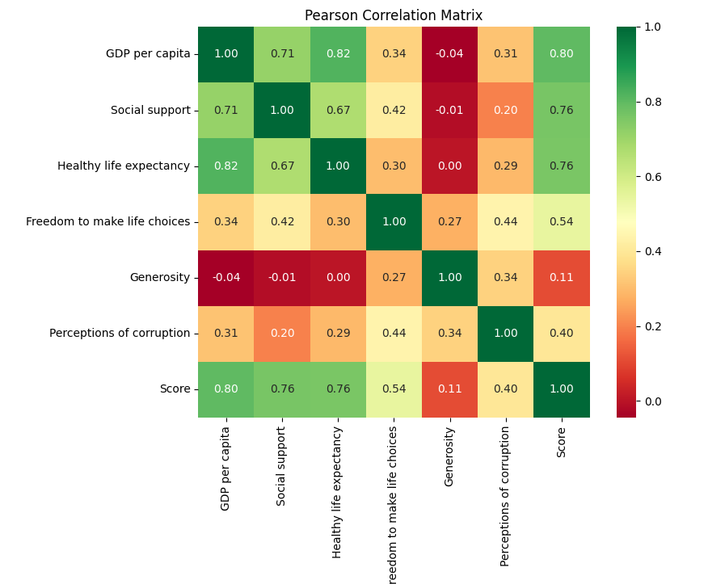
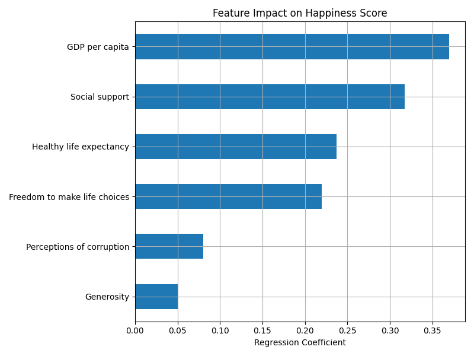
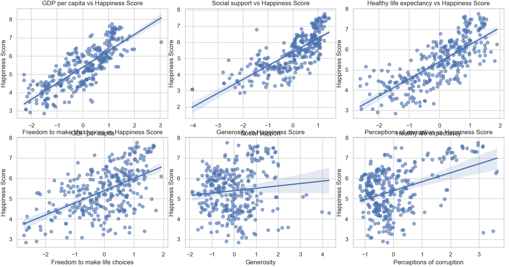

# Data Analytics - What Makes a Country Happy?

## Overview
What factors contribute to the happiness of a nation's inhabitants? Believe it or not, even
such questions can be answered using data science methods. The Happiness Index Score
has garnered significant attention in recent years as an indicator of a country's overall wellbeing and quality of life. The Happiness Index Score is calculated based on various variables
such as GDP per capita, life expectancy, and corruption.

## Task
The objective of this task is to examine the relationship between the Happiness Index Score
and other variables describing the country, such as identifying which characteristics
contribute most to a country's happiness. 

## Dataset
Dataset: [https://www.kaggle.com/datasets/debajyotipodder/co2-emission-by-vehicles](https://www.kaggle.com/datasets/debajyotipodder/co2-emission-by-vehicles)

## Preprocessing

The dataset contains data from two different years, 2018 and 2019. The data is collected into one dataset, and the column year is added.

The dataset contains the following columns:
- Overall rank
- Country or region
- Year
- Score
- GDP per capita
- Social support
- Healthy life expectancy
- Freedom to make life choices
- Generosity
- Perceptions of corruption

It contains 312 rows

### Standardization

The dataset contains some columns that are not in the same range. For example, the GDP per capita is in the range of 0 to 100, while the score is in the range of 0 to 10. To standardize the data, we can used Z-score normalization. This method transforms the data into a standard normal distribution with a mean of 0 and a standard deviation of 1.

## Results

### Pearson Correlation

The code can be found in the `pearson.py` file.

### Linear Regression
The code can be found in the `regression.py` file.

### Scatter Plot
The code can be found in the `scatterplots.py` file.

