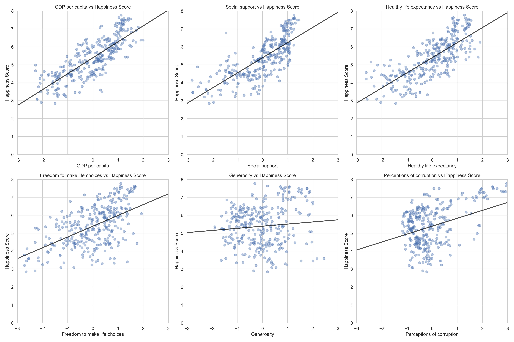
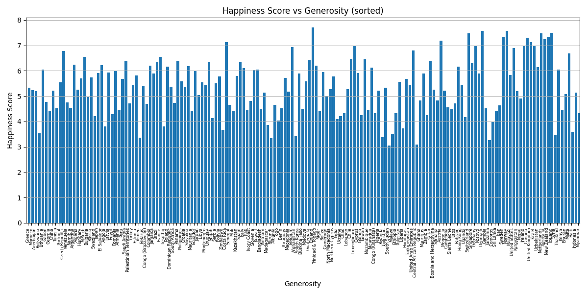

# Data Analytics - What Makes a Country Happy?

## Executive Summary

This project investigates key factors contributing to national happiness using data from 2018 and 2019. Through correlation analysis and linear regression, we identify which socioeconomic indicators most strongly influence happiness scores.

## Overview
What factors contribute to the happiness of a nation's inhabitants? Believe it or not, even
such questions can be answered using data science methods. The Happiness Index Score
has garnered significant attention in recent years as an indicator of a country's overall wellbeing and quality of life. The Happiness Index Score is calculated based on various variables such as GDP per capita, life expectancy, and corruption.

Understanding what makes a country happy can inform public policy and guide governments in prioritizing social and economic reforms.

## Task
The objective of this task is to examine the relationship between the Happiness Index Score
and other variables describing the country, such as identifying which characteristics
contribute most to a country's happiness. 

## Dataset
Dataset: [https://www.kaggle.com/datasets/sougatapramanick/happiness-index-2018-2019](https://www.kaggle.com/datasets/sougatapramanick/happiness-index-2018-2019)

## Preprocessing

The dataset contains data from two different years, 2018 and 2019. The data is collected into one dataset, and the column year is added.

The dataset contains the following columns:
- Overall rank
    - The rank of the country in the Happiness Index Score, not used in the analysis
- Country or region
    - The name of the country or region
- Year
    - The year of the data collection
- Score
    - The Happiness Index Score, a measure of the overall happiness of the country from 0 to 10, where 0 is the lowest and 10 is the highest
- GDP per capita
    - The GDP per capita of the country, a measure of the economic strength of the country
- Social support
    - The social support of the country, a measure of the interpersonal networks and social connections of the country
- Healthy life expectancy
    - The healthy life expectancy of the country, a measure of the health and well-being of the country
- Freedom to make life choices
    - The freedom to make life choices of the country, a measure of the personal freedom and autonomy of the country
- Generosity
    - The generosity of the country, a measure of the charitable behavior and altruism of the country
- Perceptions of corruption
    - Note: The variable reflects the absence of corruption, meaning higher values indicate less perceived corruption.

It contains 312 rows

### Standardization

The dataset contains some columns that are not in the same range. For example, the GDP per capita is in the range of 0 to 100, while the score is in the range of 0 to 10. To standardize the data, we can used Z-score normalization. This method transforms the data into a standard normal distribution with a mean of 0 and a standard deviation of 1.

## Results

### Pearson Correlation

The code can be found in the `pearson.py` file.

As seen in the correlation matrix, GDP per capita, social support and healthy life expectancy have the highest positive correlation with the Happiness Score. This suggests that economic strength and interpersonal networks significantly and health contribute most to national happiness.

On the other hand, generosity has the lowest correlation with the Happiness Score. This suggests that generosity does not significantly contribute to national happiness.

### Linear Regression
The code can be found in the `regression.py` file.

The linear regression model was used to identify which factors contribute most to a country's Happiness Score. The analysis shows that GDP per capita, social support, and healthy life expectancy are the most influential predictors, with respective coefficients of 0.37, 0.32, and 0.24. This suggests that, holding other variables constant, a one-unit increase in GDP per capita is associated with a 0.37 increase in the Happiness Score.

Other predictors such as freedom to make life choices (0.22), perceptions of corruption (0.08), and generosity (0.05) also show a positive relationship, although their impact is less substantial.

The model achieved an R-squared value of 0.784, meaning that approximately 78.4% of the variance in the Happiness Score can be explained by these predictors. This high R-squared value indicates that the model provides a strong fit to the data and that the selected variables capture most of the relevant information affecting national happiness.

### Scatter Plot
The code can be found in the `scatterplots.py` file.

The scatter plots show the relationship between the Happiness Score and the other variables. The scatter plots show a positive correlation between the Happiness Score and GDP per capita, social support, and healthy life expectancy. This suggests that as these variables increase, the Happiness Score also increases.

### Bar Plots

#### GDP vs Happiness Score

#### Social Support vs Happiness Score

#### Healthy Life Expectancy vs Happiness Score

#### Generosity vs Happiness Score

The bar plots show the relationship between the Happiness Score and the other variables. The bar plots show a positive correlation between the Happiness Score and GDP per capita, social support, and healthy life expectancy. This suggests that as these variables increase, the Happiness Score also increases. 

On the other hand, the bar plot for generosity shows a low correlation with the Happiness Score. This suggests that generosity does not significantly contribute to national happiness. The wide spread of the values in the bar plot indicates that there are some countries with high generosity but low happiness scores, and vice versa. This visualizes that generosity is not a strong predictor of national happiness.

## Conclusion

The analysis of the Happiness Index Score dataset reveals that GDP per capita, social support, and healthy life expectancy are the most significant predictors of national happiness. The linear regression model achieved a high R-squared value, indicating a strong fit to the data. The scatter plots and bar plots further illustrate the positive relationships between these variables and the Happiness Score.

The findings suggest that policymakers should prioritize economic growth, social support systems, and healthcare improvements to enhance the well-being of their citizens. While generosity and perceptions of corruption also play a role, their impact is less pronounced compared to the other factors.

## Future Work

TODO
